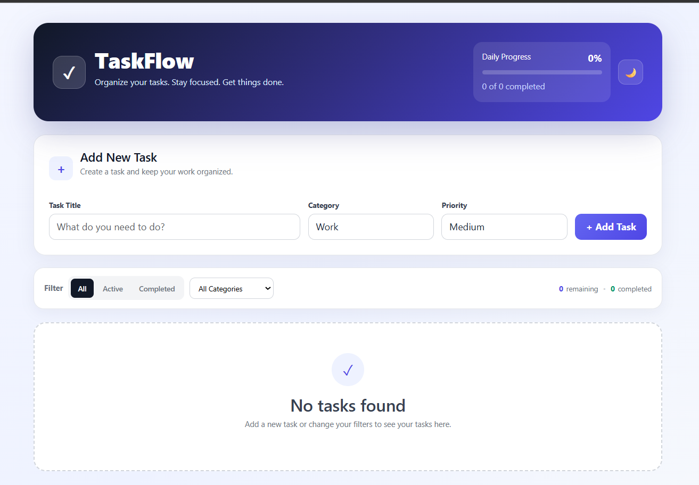
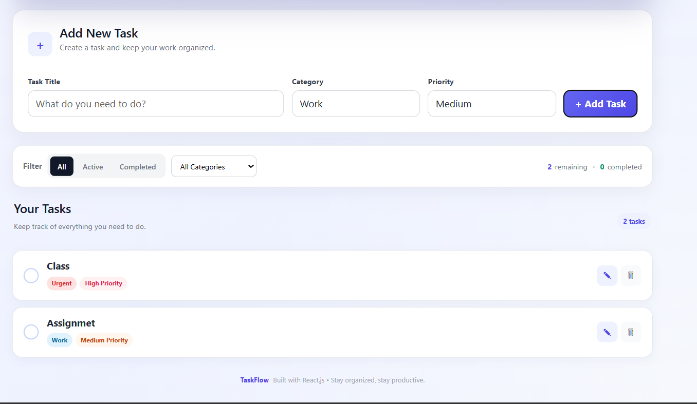

# TaskFlow – Personal Task Manager

TaskFlow is a single-page To-Do application built with React and Vite. It lets you add, edit, complete and delete tasks, organize them by category and priority, and keeps everything saved in your browser so nothing is lost on refresh.

## Screenshots

**Home screen (empty state)**



**Task list with categories and priorities**



## Features

- Add, edit, delete, and mark tasks as complete
- Filter tasks by status (All / Active / Completed)
- Organize tasks by category (Work, Personal, Urgent)
- Set a priority (Low, Medium, High) for each task
- Tasks persist in `localStorage` and survive a page refresh
- Live count of remaining and completed tasks
- "Clear Completed" button to remove finished tasks in one click
- Daily progress bar showing the completion percentage
- Dark / light theme toggle (remembered between visits)
- Empty state message when no tasks match the filters
- Responsive layout for desktop and mobile

## Technologies Used

- React 18 (functional components and hooks)
- React Router DOM 6
- Vite
- CSS (custom styles)
- ESLint

## Project Structure

```
src/
├── Components/   Header, TaskForm, FilterBar, TaskList, TaskItem, Footer
├── hooks/        useLocalStorage (custom hook)
├── pages/        Layout, Home
├── assets/       Style.css
├── MyRoute.jsx   Router setup
└── main.jsx      App entry point
```

## Setup Instructions

1. Clone the repository:
   ```bash
   git clone <your-repository-url>
   cd todo-app
   ```
2. Install dependencies:
   ```bash
   npm install
   ```
3. Start the development server:
   ```bash
   npm run dev
   ```
4. Open the local URL shown in the terminal (usually `http://localhost:5173`).

To create a production build, run `npm run build`.

## Known Limitations

- Tasks are stored only in the browser's `localStorage`, so they are not synced across devices.
- Categories are fixed to Work, Personal, and Urgent (custom categories are not supported yet).
- Drag-and-drop reordering and due dates are not implemented.
